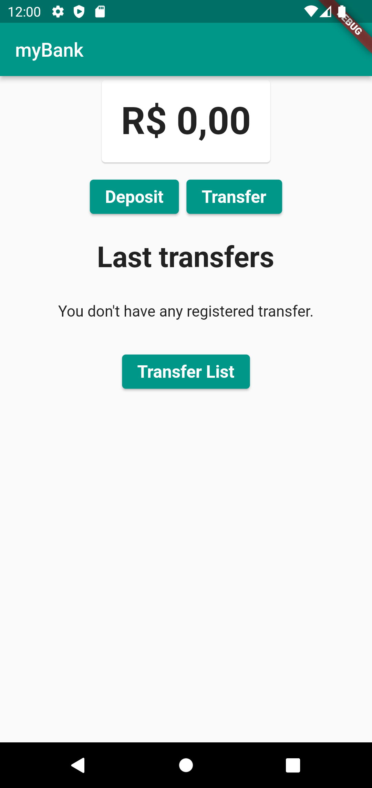
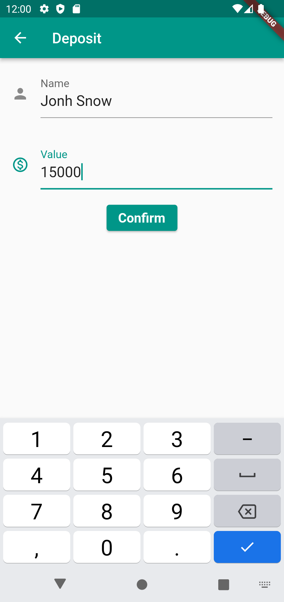
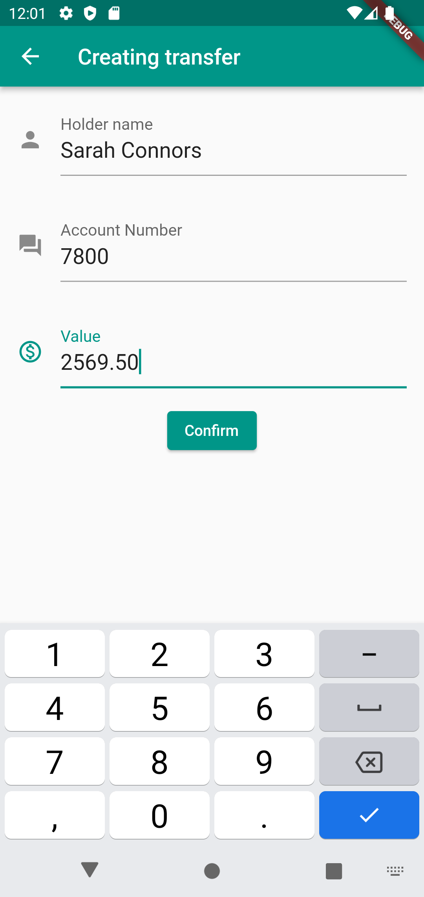
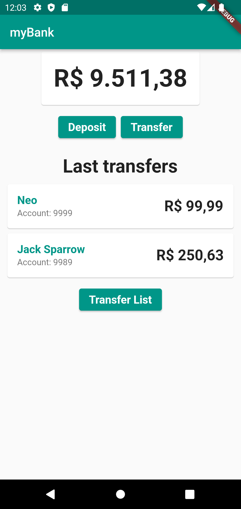
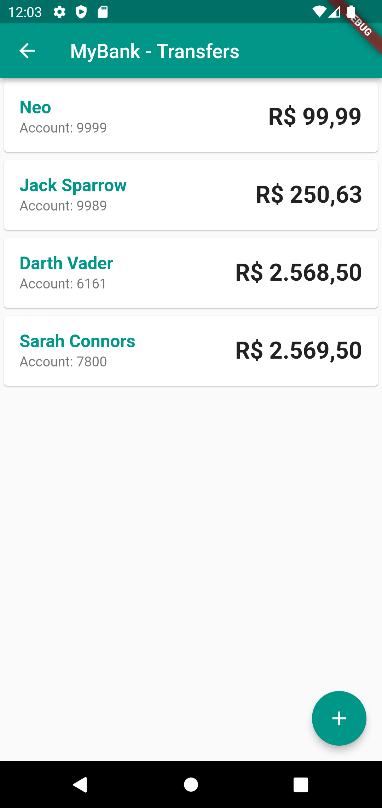

# Flutter - Gerenciamento de Estados com Provider

## Objetivos ao completar os estudos
- Aprenda a gerenciar o estado da sua aplicação com Single Source of Truth
- Utilizar o Provider para gerenciar o estado de forma escalável
- Consuma os dados do Provider com o Consumer
- Separe a sua aplicação por responsabilidade
- Entender as diferenças entre Provider.of e Consumer

## Ementas:
### Criando o dashboard
- Preparando o ambiente
- Novidades
- Dashboard e saldo
- Saldo
- Formatação do saldo
- Faça como eu fiz
- O que aprendi?
    - O que nossa aplicação precisará fazer
    - Criar componente de dashboard e de saldo
    - Separar responsabilidade na criação de novos widgets

### Gerenciamento de estados
- Single Source of Truth
- Provider
- Singleton
- Consumer
- Provider
- Faça como eu fiz
- O que aprendi?
    - A importância de manter o estado da nossa aplicação em um único lugar, aplicando o Single Source of Truth (Única Fonte de Verdade)
    - Como instanciar e gerenciar uma classe uma única vez através do Provider
    - Como consumir essa classe através do Consumer

### Usando Provider
- Notify Listeners
- Depósito
- Provider.of
- Atualização do Saldo
- Selector
- Faça como eu fiz
- O que aprendi?
    - Como gerenciar o conteúdo do nosso Saldo em um único lugar
    - Consumir os nossos dados com o Consumer
    - Notificar quem estiver usando os dados do nosso saldo através do NotifyListeners

### Gerenciando as transferências
- MultiProvider
- Model de transferências
- Adicionar transferência
- Saldo suficiente
- Múltiplas classes no Provider
- Faça como eu fiz
- O que aprendi?
    - Como gerenciar múltiplas classes com o MultipleProvider
    - Adicionar uma Transferência através do Provider
    - Fazer com que essa transferência esteja vinculada com o saldo da conta

### Validando e finalizando o app
- Lista de Transações
- Últimas Transferências
- Validações finais
- Componentização da nossa aplicação
- Faça como eu fiz
- Projeto final
- Conclusão
- O que aprendi?
    - Como componentizar melhor nossa aplicação, utilizando o mesmo formulário para cadastrar     - transferências tanto na página inicial, quanto na página de transferências
    - Criar uma lista com as últimas transferências realizadas
    - Atualizar as listas de acordo com o Provider

***

## MyBank - Flutter project screens.

